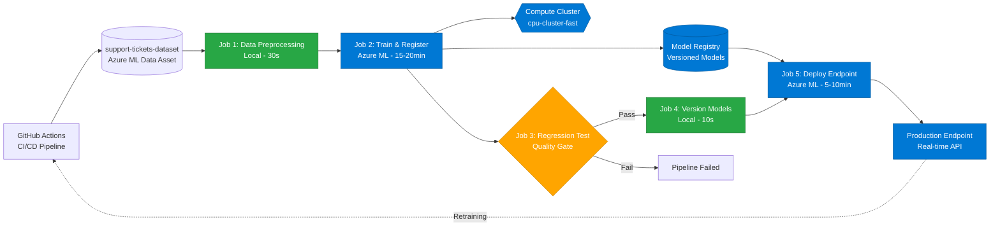

# Mermaid Flowchart Diagram Prompt

## Instructions for AI/Mermaid Code Generator

Please create a Mermaid flowchart diagram that represents my complete MLOps CI/CD pipeline. The diagram should match the style and structure of the reference image I provided, with clear visual distinction between different types of components.

---

## Pipeline Architecture to Diagram

### Visual Style Requirements:
- Use a left-to-right flowchart (LR direction)
- Use different shapes/colors for different component types:
  - **Rectangles with rounded corners** for jobs/processes
  - **Cylinders/databases** for data storage (datasets, model registry)
  - **Parallelograms** for GitHub Actions triggers
  - **Hexagons** for compute resources
  - **Cloud shapes** or special styling for Azure ML components
  - **Different colors** for different stages (preprocessing=green, training=blue, testing=orange, deployment=purple)

### Components and Flow:

#### 1. **Trigger (Start)**
- Component: GitHub Actions CI/CD Pipeline
- Trigger: `git push` to main branch or manual workflow_dispatch
- Label: "GitHub Actions CI/CD"
- Shape: Parallelogram or special GitHub icon
- Color: Black/Dark gray

#### 2. **Data Storage**
- Component: Azure ML Data Asset
- Name: "support-tickets-dataset"
- Type: Blob storage / Data Asset
- Shape: Cylinder (database shape)
- Color: Light blue
- Note: "Version 1"

#### 3. **Job 1: Data Preprocessing**
- Name: "Data Quality & Unit Tests"
- Actions:
  - Load dataset
  - Clean & validate data
  - Feature engineering
  - Train/test split
- Platform: Local (GitHub Actions runner)
- Duration: ~30 seconds
- Shape: Rectangle with rounded corners
- Color: Green
- Output: Processed data artifact

#### 4. **Job 2: Model Training**
- Name: "Train & Register Model (Azure ML)"
- Actions:
  - Train Iteration 1: Random Forest (baseline)
  - Train Iteration 2: XGBoost (improved)
  - Log metrics to Azure ML Studio
  - Download model artifacts
  - **Register models in Model Registry**
- Platform: Azure ML Cloud
- Compute: cpu-cluster-fast (hexagon shape)
- Duration: ~15-20 minutes
- Shape: Rectangle with rounded corners
- Color: Blue
- Output arrows to:
  - Model Registry (cylinder)
  - Metrics/logs

#### 5. **Compute Cluster**
- Component: Azure ML Compute Cluster
- Name: "cpu-cluster-fast"
- Type: STANDARD_DS2_V3
- Features: Auto-scaling (0→1→0)
- Shape: Hexagon
- Color: Orange
- Connected to: Job 2 (Training)

#### 6. **Model Registry**
- Component: Azure ML Model Registry
- Models stored:
  - support-ticket-classifier-rf (Random Forest baseline)
  - support-ticket-classifier (XGBoost production)
- Shape: Cylinder (database)
- Color: Purple
- Versioning: Automatic (GitHub run number)

#### 7. **Job 3: Regression Testing**
- Name: "Deploy Request - Confirm Training Improvement"
- Actions:
  - Compare Iteration 2 vs Iteration 1
  - Check 2% performance threshold
  - Generate evaluation report
  - **FAIL pipeline if regression detected**
- Platform: Local (GitHub Actions runner)
- Duration: ~5 seconds
- Shape: Rectangle with rounded corners
- Color: Orange
- Decision node: Pass/Fail quality gate

#### 8. **Job 4: Model Versioning**
- Name: "Version & Prepare Models"
- Actions:
  - Create version tag (timestamp)
  - Generate pipeline summary
  - Prepare for deployment
- Platform: Local (GitHub Actions runner)
- Duration: ~10 seconds
- Shape: Rectangle with rounded corners
- Color: Light purple
- Dependency: Only runs if Job 3 passes

#### 9. **Job 5: Online Endpoint Deployment**
- Name: "Create/Update Endpoint"
- Actions:
  - Create endpoint: support-ticket-classifier
  - Deploy latest model from registry
  - Blue-green deployment strategy
  - Route 100% traffic to new version
- Platform: Azure ML Cloud
- Endpoint type: Managed Online Endpoint
- Instance: Standard_DS2_v2
- Duration: ~5-10 minutes
- Shape: Rectangle with rounded corners
- Color: Deep purple
- Output: Production API endpoint

#### 10. **Production Endpoint**
- Component: Azure ML Online Endpoint
- Name: "support-ticket-classifier"
- Type: Real-time inference API
- Authentication: API key
- Shape: Cloud or rounded rectangle with special border
- Color: Green (production/live)
- Features:
  - RESTful API
  - Scoring URI
  - Real-time predictions

#### 11. **Feedback Loop: Retraining**
- Component: Continuous retraining trigger
- Trigger: Code/data changes → git push → restart pipeline
- Arrow: From production back to GitHub Actions
- Style: Dashed line
- Label: "Perform Retraining"

---

## Flow Connections (Arrows)

### Main Flow:
1. GitHub Actions → Data Asset (fetch data)
2. Data Asset → Job 1: Data Preprocessing
3. Job 1 → Job 2: Train & Register Model
4. Job 2 → Compute Cluster (uses for training)
5. Job 2 → Model Registry (register models)
6. Job 2 → Job 3: Regression Testing (pass metrics)
7. Job 3 → **Decision Diamond**: Improvement confirmed?
   - If YES → Job 4: Version Models
   - If NO → FAIL (red X, pipeline stops)
8. Job 4 → Job 5: Deploy Endpoint
9. Model Registry → Job 5 (fetch model to deploy)
10. Job 5 → Production Endpoint (deploy model)
11. Production Endpoint → GitHub Actions (dashed line: retraining feedback)

### Side Connections:
- Job 2 logs metrics → Azure ML Studio (Metrics tab)
- All jobs → GitHub Actions Summary (reporting)

---

## Labels and Annotations

### Add These Text Annotations:
- **On Job 1**: "Local - Fast (~30s)"
- **On Job 2**: "Cloud - Scalable (~15-20 min)"
- **On Compute Cluster**: "Auto-scales: 0→1→0 nodes"
- **On Model Registry**: "Versioned models with lineage"
- **On Job 3**: "Quality Gate: 2% threshold"
- **On Job 5**: "Blue-Green Deployment"
- **On Production Endpoint**: "Real-time inference API"
- **On Feedback Loop**: "Automated retraining on code/data changes"

---

## Color Scheme Suggestion:

```
GitHub Actions (trigger): #24292e (dark gray)
Data Asset: #0078d4 (Azure blue)
Job 1 (Preprocessing): #28a745 (green)
Job 2 (Training): #0366d6 (blue)
Compute Cluster: #f66a0a (orange)
Model Registry: #6f42c1 (purple)
Job 3 (Testing): #ffa500 (orange)
Job 4 (Versioning): #9d4edd (light purple)
Job 5 (Deployment): #5a32a3 (deep purple)
Production Endpoint: #28a745 (green - live)
Fail/Error: #d73a49 (red)
```

---

## Additional Styling Notes:

1. **Use subgraphs** to group related components:
   - Subgraph 1: "GitHub Actions CI/CD"
   - Subgraph 2: "Azure ML Cloud Infrastructure" (contains Compute, Registry, Endpoint)
   - Subgraph 3: "Quality Gates" (contains Job 3 decision)

2. **Arrow styles**:
   - Solid arrows (→) for main flow
   - Dashed arrows (-->) for feedback/monitoring
   - Thick arrows (==>) for critical path (data flow)
   - Dotted arrows (...>) for optional/conditional paths

3. **Add icons** if possible:
   - GitHub icon for GitHub Actions
   - Cloud icon for Azure components
   - Database icon for storage
   - Checkmark for passed tests
   - X mark for failed tests

---

## Example Mermaid Structure to Follow:



---

## Expected Output Format:

Please provide:
1. **Complete Mermaid code** (copy-paste ready)
2. **Syntax**: Use `graph LR` for left-to-right flowchart
3. **Comments**: Include comments in the code to explain sections
4. **Styling**: Apply the color scheme suggested above
5. **Readability**: Use line breaks and spacing for clarity

---

## Validation Checklist:

The final diagram should show:
- ✅ All 5 jobs in sequence
- ✅ GitHub Actions trigger at start
- ✅ Data asset (cylinder shape)
- ✅ Compute cluster connected to training
- ✅ Model Registry connected to training and deployment
- ✅ Decision node at regression testing
- ✅ Production endpoint at the end
- ✅ Feedback loop (dashed line) for retraining
- ✅ Clear visual hierarchy (triggers → processing → storage → deployment)
- ✅ Color coding by component type
- ✅ Duration labels on each job

---

## Use This Prompt With:

- ChatGPT / Claude / Gemini: "Using the specifications above, generate Mermaid flowchart code"
- Mermaid Live Editor: Copy the generated code to https://mermaid.live
- GitHub Markdown: Paste in `.md` file between ```mermaid code blocks
- Draw.io Mermaid plugin: Import the generated code

---

## Notes:

This represents a **complete enterprise MLOps pipeline** with:
- Automated CI/CD
- Cloud training infrastructure
- Quality gates (regression testing)
- Model registry with versioning
- Production deployment
- Continuous retraining feedback loop

The diagram matches the reference architecture and demonstrates all components of the coursework requirements.
